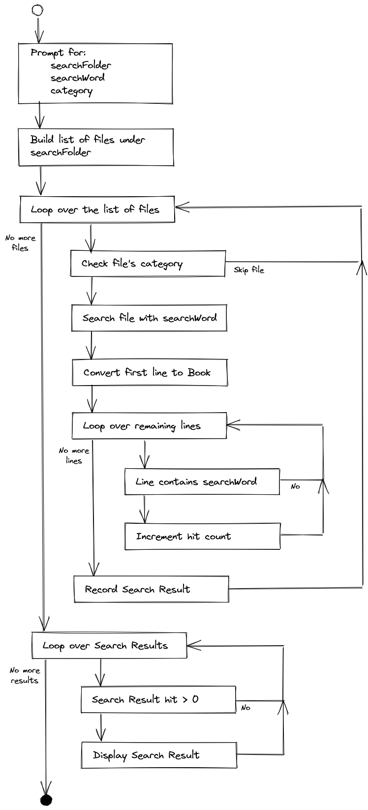

# Review Day 8 exercise

Recently you completed an exercise for an application that searched for a term in a single book. While that satisfied the requirements at the time, it could do a lot more. It prompted users for a single book to search and a search word. The new version has the following improvements:

* Rather than searching a single book, users can search through all the books in a given folder.
* Books are categorized as a novel, short story, or collection, and users are able to limit a search to a given category.
* The search provides more information regarding the books searched, such as author, date published, and page count.

## Requirements

* The project must not have any build errors.
* Code uses appropriate variable names and data types.
* Code is in a clean, organized format.
* Code is appropriately encapsulated.
* The code meets the following specifications.

## Step One: Review the starting code

Take a moment to explore the starting code and files:

* `books/`
  * This folder contains nearly two dozen novels, short stories, and collections from [Project Gutenberg](https://www.gutenberg.org/).
  * Each file has been categorized with one of the following extensions: `.novel`, `.story`, or `.collection`.
  * The first line in each file contains metadata describing the novel, short story, or collection. The metadata is pipe `|` delimited:
    * `title|author|publisher|date published|page count`
    * For example:
      * The file `a-little-journey.story` contains:<br>`A Little Journey|Ray Bradbury|Galaxy Science Fiction August 1951|1951-08-01|7`
      * The file `war-and-peace.novel` contains:<br>`War and Peace|Leo Tolstoy|William S. Gottsberger (English)|1886-01-01|1225`
* `com.techelevator.util`
  * `BasicConsole.java`: interface defining a simple UI oriented around menus and prompting the user for input.
  * `SystemInOutConsole.java`: implements the `BasicConsole` interface, providing text-based UI using `System.In` and `System.out`. Take note of the methods that begin with `print`, you can use these in this exercise.
  * `BasicConsole.java` and `SystemInOutConsole.java` are provided *as is* and aren't intended to be edited.
* `com.techelevator`
  * `Application.java`: Setup of a text-based UI and controller for console applications.
  * `Book.java`: Class containing the metadata for a book.
  * `SearchResult.java`: Class representing a particular search result, containing the corresponding `Book` and various search result values such as the number of times the search word was found.
  * `WordSearchController.java`: The heart of the Word Search application, and where you'll write your code. The calls to search prompts have been provided in the starter code.
  * `WordSearchView.java`: Contains the search prompts and various convenience methods to display output.<br>Review the `promptForSearchFolder()`, `promptForSearchWord()`, and `promptForCategory()` methods to familiarize yourself with the validations each prompt performs.
  * `Application.java`, `Book.java`, `SearchResult`, and `WordSearchView.java` are provided *as is* and aren't intended to be edited.

The overall flow of the application is shown in this flowchart:



Briefly, the new Word Search application prompts the users for the search folder, search word, and category. It builds a list of the files found under the search folder which it then loops through one file at time. Each file is checked to see if meets the category the user entered at the prompt. If the file meets the category it's searched, otherwise, the file is skipped, and the application continues onto the next file in the list.

Searching a file begins with converting the first line of metadata into a `Book` object. (See "metadata" under the `books` folder discussed previously.) The search continues looping though the remaining lines in the file, and increments a hit count whenever a line contains the search word. Regardless of the hit count, the `Book` object, the hit count, and various other search values are used to instantiate a new `SearchResult` object. Each `SearchResult` object is added to the list of search results.

Once all the appropriate files have been searched, the application loops through the list of search results created during the file searches, and if the hit count is greater than 0 for a search result, the search result is displayed.

## Step Two: Run the starting code

There are no unit tests for this exercise, so to confirm your work you'll need to periodically run the application and examine the output. Begin with a baseline of the starting code and run the Word Search application now. The `main()` method is located in `Application.java`.

As mentioned in Step One, the prompts for the search folder, search word, and category are already in place, so you'll be prompted for the three values, and then the application terminates.

In this first example of running the application, the search folder is the `books` folder described previously. The search word is `Alice` and the category is `novel`:

```
Enter the path of the search folder: books
Enter the search word: Alice
Enter a category to filter by (novel, story, collection, or leave blank for all): novel
```

> Note: `Alice` is capitalized. Search is case-sensitive.

## Step Three: Build the list of files and filter by a category

Open `WordSearchController.java` and examine the `run()` method. Look for the `Your code begins here` comment following the three search prompts. Your work starts under the comment.

Begin by using the `java.io.File` method `listFiles()` to return an array of `File` objects which you'll then loop through.

> Note: The `promptForSearchFolder()` method returns a `File` object `folderToSearch` which you can use to call `listFiles()`.

As you walk one-by-one through the array of `File` objects, retrieve each object's filename and see if ends with the value in `category`. If it does, the file is searched, otherwise, the file is skipped.

> Note: If `category` is blank you don't need to explicitly check the filename since blank means search *all* files regardless of their individual category.

For each file to be searched, use `view.printMessage()` to display the message `"Searching "` followed by the name of the search file.

When ready, rerun the application with the same previous values for the prompts from Step Two, and if all goes well, you'll see the following:

```
Enter the path of the search folder: books
Enter the search word: Alice
Enter a category to filter by (novel, story, collection, or leave blank for all): novel

Searching alice-in-wonderland.novel
Searching frankenstein.novel
Searching pride-and-prejudice.novel
Searching right-ho-jeeves.novel
Searching the-call-of-the-wild.novel
Searching the-island-of-dr-moreau.novel
Searching the-land-that-time-forgot.novel
Searching the-murder-on-the-links.novel
Searching the-sun-also-rises.novel
Searching through-the-looking-glass.novel
Searching war-and-peace.novel
Searching winnie-the-pooh.novel
```

Rerun the application with `story` as the category and the list of files is:

```
Searching a-little-journey.story
Searching a-pail-of-air.story
Searching hall-of-mirrors.story.story
Searching in-the-year-2889.story
Searching song-in-a-minor-key.story
Searching subject-to-change.story
```

Rerun the application with `collection` as the category and the list of files is:

```
Searching love-and-other-stories.collection
Searching sixes-and-sevens.collection
Searching tales-of-the-jazz-age.collection
```

Finally, rerun the application one last time without a category and all the files are listed:

```
Searching a-little-journey.story
Searching a-pail-of-air.story
Searching alice-in-wonderland.novel
Searching frankenstein.novel
Searching hall-of-mirrors.story.story
Searching in-the-year-2889.story
Searching love-and-other-stories.collection
Searching pride-and-prejudice.novel
Searching right-ho-jeeves.novel
Searching sixes-and-sevens.collection
Searching song-in-a-minor-key.story
Searching subject-to-change.story
Searching tales-of-the-jazz-age.collection
Searching the-call-of-the-wild.novel
Searching the-island-of-dr-moreau.novel
Searching the-land-that-time-forgot.novel
Searching the-murder-on-the-links.novel
Searching the-sun-also-rises.novel
Searching through-the-looking-glass.novel
Searching war-and-peace.novel
Searching winnie-the-pooh.novel
```

## Step Four: Search the file and record the search result

Now that the files to be searched have been identified, it's time to perform the actual search. You may continue to write your code within the loop through the files itself, or you may decide to create a `search()` method within `WordSearchController` which is called within the loop. If you decide to write a `search()` method, it's up to you to decide its return type and what, if any, arguments to take.

In any case, the two most important values in any given search are the current `File` object to be searched and the word to search for.

To begin the search, open the file. You may handle any potential exception as you like, but you can't just ignore it. A simple display of the error message suffices for the exercise. You can use the `view.printErrorMessage()` method for this.

Then as outlined in the flowchart, the code must extract the metadata from the first line and build a `Book` object from it. The line may be split with `"\\|"`.

Each subsequent line in the remainder of the file needs to be examined to see if it contains the search word. The hit count is incremented for each line that contains the search word.

Use the `Book` object created for this file plus the other search values such as hit count to create an instance of `SearchResult`. The new instance needs to be added to a list of all the search results for later display in Step Five.

End the search by printing a short statement of the number of hits:

`(hitCount occurrences of "searchWord")`

For example:

`(398 occurrences of "Alice")`

or in the case of 0 hits:

`(no hits)`

When ready, you may confirm your work by running the application as shown here:

```
Enter the path of the search folder: books
Enter the search word: Alice
Enter a category to filter by (novel, story, collection, or leave blank for all): novel

Searching alice-in-wonderland.novel
(398 occurrences of "Alice")
Searching frankenstein.novel
(no hits)
Searching pride-and-prejudice.novel
(no hits)
Searching right-ho-jeeves.novel
(no hits)
Searching the-call-of-the-wild.novel
(1 occurrences of "Alice")
Searching the-island-of-dr-moreau.novel
(no hits)
Searching the-land-that-time-forgot.novel
(no hits)
Searching the-murder-on-the-links.novel
(no hits)
Searching the-sun-also-rises.novel
(no hits)
Searching through-the-looking-glass.novel
(464 occurrences of "Alice")
Searching war-and-peace.novel
(no hits)
Searching winnie-the-pooh.novel
(no hits)
```

Try running other combinations of search words and categories to build further confidence in your work.

## Step Five: Display the search results

The final task of the Word Search is to display the search results summary. Provided the individual `SearchResult` objects were added to an accessible list during the search, it's a straightforward process of looping through the list printing the individual `SearchResult` objects which have hit counts greater than zero.

Print a summary header `SEARCH RESULTS` followed by a numbered list with each `SearchResult` object in the following format:

```
SEARCH RESULTS

1.  {TITLE} ({count} occurrences of {search word})
    Author: {AUTHOR}
    Category: {CATEGORY} ((PAGE_COUNT pages))
    Publisher: {PUBLISHER}
    Year: (YEAR)
```

Once the code is in place, run the application and review the search results summary.

```
Enter the path of the search folder: books
Enter the search word: Alice
Enter a category to filter by (novel, story, collection, or leave blank for all): novel

Searching alice-in-wonderland.novel
(398 occurrences of "Alice")
Searching frankenstein.novel
(no hits)
Searching pride-and-prejudice.novel
(no hits)
Searching right-ho-jeeves.novel
(no hits)
Searching the-call-of-the-wild.novel
(1 occurrences of "Alice")
Searching the-island-of-dr-moreau.novel
(no hits)
Searching the-land-that-time-forgot.novel
(no hits)
Searching the-murder-on-the-links.novel
(no hits)
Searching the-sun-also-rises.novel
(no hits)
Searching through-the-looking-glass.novel
(464 occurrences of "Alice")
Searching war-and-peace.novel
(no hits)
Searching winnie-the-pooh.novel
(no hits)

SEARCH RESULTS

1.  Alice's Adventures in Wonderland (398 occurrences of "Alice")
	  Author: Lewis Carroll
	  Category: Novel (70 pages)
	  Publisher: Macmillan
	  Year: 1865
2.  The Call of the Wild (1 occurrences of "Alice")
	  Author: Jack London
	  Category: Novel (232 pages)
	  Publisher: Macmillian
	  Year: 1903
3.  Through the Looking Glass (464 occurrences of "Alice")
	  Author: Lewis Carroll
	  Category: Novel (208 pages)
	  Publisher: Macmillan
	  Year: 1871
```

**This completes the required features of the new Word Search application.**

## Optional

If interested there are a number of optional improvements you individually or with your pair can implement:

1. Without combining the two calls of `printMessage("Searching...")` and `printMessage("...occurrences of...")` into one, review all the existing methods in `WordSearchView` and see if there is a way to adjust the calls to the `printMessage()` to display the two messages on a single line:<br>`Searching alice-in-wonderland.novel (398 occurrences of "Alice")`
2. Include a prompt to ask the user if search should be case sensitive, `Should the search be case sensitive? (Y\n)?`. The default is `"Y"`. Adjust the search to use case sensitivity accordingly.
3. The search is only required to determine if a line contains the search word. However, this doesn't always give a true count of the number of times the search word actually exists. For instance,<br>`"Alice, Alice, Alice", Alice's exasperated mother said to Alice", clearly has more than one Alice.`<br>Consider using the `String` method `indexOf(String str, int fromIndex)` in the search to obtain a more accurate count.
4. Ideally, the search results summary would display the search results in descending order by the number of hits. In the case of ties on hits, tying books are displayed in ascending order by title.
