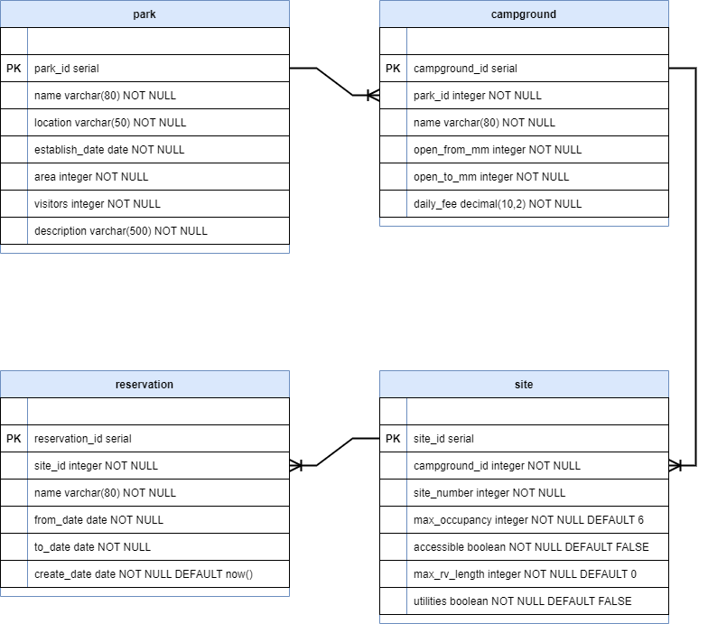

# Pair Programming Exercise: National Park Campsite

The National Park Service has hired you as its newest developer. For your first assignment, your manager tasked you with writing queries against the National Park Campsite Reservation database. Before you write queries, you'll need to review the database's schema and data.

## Step One: Getting started

1. Create a new database called `campground`.
2. Select the new database and open the `database/campground_with_animal.sql` file in pgAdmin.
3. Run the database script in the file by clicking the **Execute/Refresh** button.

## Step Two: Review database schema and data

Before writing any queries, you need to review each table. Focus on understanding the purpose of each table, the primary and foreign keys, constraints, and how the tables relate to each other. Then, look at the sample data within each of the tables.

Here is a drawing of the database schema. Following the drawing are details about each table.

### Park table

The `park` table provides the data for each of the supported national parks. The data columns are as follows:

|    | Field          | Description                                |
|----|----------------|--------------------------------------------|
| PK | park_id        | A surrogate key for the park.              |
|    | name           | The name of the park.                      |
|    | location       | The location of the park.                  |
|    | establish_date | The creation date of the park.             |
|    | area           | The size of the park in square kilometers. |
|    | visitors       | The annual number of visitors to the park. |
|    | description    | A short description about the park.        |

### Campground table

The `campground` table provides a list of the one or many campgrounds located inside of a national park. The data columns are as follows:

|    | Field         | Description                                                                                     |
|----|---------------|-------------------------------------------------------------------------------------------------|
| PK | campground_id | A surrogate key for the campground.                                                             |
| FK | park_id       | The park in which the campground resides                                                |
|    | name          | The name of the campground.                                                                     |
|    | open_from_mm  | The first numerical month the campground is open for reservation. (1:January, 2:February, etc.)   |
|    | open_to_mm    | The last numerical month the campground is open for reservation. (1:January, 2:February, etc.) |
|    | daily_fee     | The daily fee for booking a campsite at this campground.                                        |

### Site table

The `site` table lists all of the campsites available for reservation in a campground. The data columns are as follows:

|    | Field         | Description                                                                                        |
|----|---------------|----------------------------------------------------------------------------------------------------|
| PK | site_id       | A surrogate key for the campsite.                                                                  |
| FK | campground_id | The campground that contains the site.                                                       |
|    | site_number   | The arbitrary campsite number.                                                                     |
|    | max_occupancy | Maximum occupancy at the campsite.                                                                 |
|    | accessible    | Indicates whether or not the campsite is handicap accessible.                                      |
|    | max_rv_length | The maximum RV length that the campsite can fit. 0 indicates that no RV fits at this campsite.     |
|    | utilities     | Indicates whether or not the campsite provides access to utility hookup.                           |

### Reservation table

The `reservation` table lists all of the past, current, and future reservations for a campsite in the national park system. The data columns are as follows:

|    | Field          | Description                          |
|----|----------------|--------------------------------------|
| PK | reservation_id | A surrogate key for the reservation. |
| FK | site_id        | The campsite the reservation is for. |
|    | name           | The name for the reservation.        |
|    | from_date      | The start date of the reservation.   |
|    | to_date        | The end date of the reservation.     |
|    | create_date    | The date of the reservation booking. |

### Animal table

The `animal` table lists a variety of animals found within the national parks system. The data columns are as follows:

|    | Field          | Description                          |
|----|----------------|--------------------------------------|
| PK | animal_id      | A surrogate key for the animal.      |
|    | name           | The common name for the animal.      |
|    | sci_name       | The scientific name of the animal.   |

### Park-Animal table

The many-to-many relationship between animals and parks requires the use of a join table such as `park_animal`. Each row offers information on a single species found within a single park in the database. The data columns are as follows:

|    | Field          | Description                          |
|----|----------------|--------------------------------------|
| FK | park_id        | The park in which the animal resides.|
| FK | animal_id      | The animal found in the given park.  |
|    | est_population | The estimated population of the animal in the given park. |

## Step Three: Query from multiple tables

In pgAdmin, open `step-3.sql`. Each SQL statement you need to write starts with a comment describing the requirements. In this step, you'll write eight queries.

## Step Four: Add, modify, and remove data from a database

In pgAdmin, open `step-4.sql`. You need to add a new park, campground, sites, and reservations to the National Park Database. Then create and update database entries associated with the animal populations of the parks. Each SQL statement you need to write starts with a comment describing the requirements. In this step, you'll write nine queries.

## Optional

If interested there are a number of optional improvements you can implement individually or with your partner:

### Add a `category` attribute
1. Using a SQL script, make a new table called `category`. Include in this table the attributes `category_id` (type `serial`) and `name` (type `varchar`).
2. Add records to this table using the following names ('Amphibian', 'Bird', 'Fish', 'Mammal', 'Reptile').
3. Using a SQL script create a new column `category_id` in the `animal` table.
4. Use `UPDATE` statements to assign the correct value to the `category id` column for each animal in the `animal` table.

### Add `tag` attribute and associated join table
1. Make a table called `tag` which stores information about amenities available within the park system. Some examples might include: fishing, hiking-trails, or mountain-biking.
2. Some parks have many tags. Some tags apply to many parks. Therefore parks and tags have a many-to-many relationship. Build a join table that captures this relationship.
3. Populate the new table with values, such that each row describes a single tag applied to a single park.
