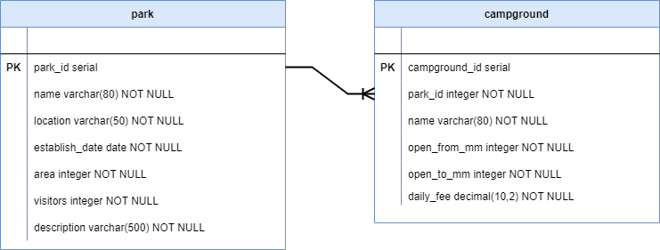

# Week 3 Review: National Park Campsite DAOs

In this exercise, you'll work with a light-weight version of the National Park Campsite Reservation database which contains just the `park` and `campground` tables.

The exercises require you to implement the DAOs for both of these tables. The DAOs have the basic CRUD methods: create, read, update, and delete.

A simple application provides the means for you to manually test your DAO methods. The application allows you to create new parks and campgrounds, and to read, update, and delete selected parks and campgrounds.

## Requirements

* The project must not have any build errors.
* Code uses appropriate variable names and data types.
* Code is in a clean, organized format.
* Code is appropriately encapsulated.

## Step One: Review the database and starting code

### Database

In the `database` folder, there's a `campground_lite.sql` SQL script that drops and recreates the tables and data in the `campground_lite` database. ***Run the script to create an instance of the `campground_lite` database***.

Here is a drawing of the database schema. Following the drawing are details about each table.

#### Park table

The `park` table contains the data for each of the national parks. The data columns are as follows:

|    | Field          | Description                                |
|----|----------------|--------------------------------------------|
| PK | park_id        | A surrogate key for the park.              |
|    | name           | The name of the park.                      |
|    | location       | The location of the park.                  |
|    | establish_date | The creation date of the park.             |
|    | area           | The size of the park in square kilometers. |
|    | visitors       | The annual number of visitors to the park. |
|    | description    | A short description about the park.        |

#### Campground table

A `campground` table contains the data for each of the campgrounds. Campgrounds relate to parks through their `park_id` foreign key. The data columns are as follows:

|    | Field         | Description                                                                                       |
|----|---------------|---------------------------------------------------------------------------------------------------|
| PK | campground_id | A surrogate key for the campground.                                                               |
| FK | park_id       | The park that contains the campground.                                                  |
|    | name          | The name of the campground.                                                                       |
|    | open_from_mm  | The first numerical month the campground is open for reservation. (1:January, 2:February, etc.)   |
|    | open_to_mm    | The last numerical month the campground is open for reservation. (1:January, 2:February, etc.)    |
|    | daily_fee     | The daily fee for booking a campsite at this campground.                                          |

### Starting code

With the exception of the `JdbcParkDao.java` and `JdbcCampgroundDao.java` class files, all other code is fully implemented and doesn't require any modification. Please take a moment to familiarize yourself with the code, and in particular look at the two *JDBC* classes. This is where you add your implementations of the DAOs for the `park` and `campground` database tables.

### Run the application

Run `Application.main()` to launch the application. As previously mentioned, it's a simple application intended to allow you to test and confirm your implementations of the park and campground DAOs. 

You must first select which data you wish to work with -- park or campground. Once you've selected the data type, you're taken to another menu where you can perform the basic CRUD operations: create, read, update, and delete. The application reminds you to select a park or campground if you haven't done so before to attempting to view, update, or delete. Additionally, you're not permitted to select a campground from the main menu until you have first selected a park.

> Note: The application is intentionally very light-weight in terms of exception handling and validation. Outside of making sure you've selected a park prior to working with campgrounds, or selected a park or campground to update or delete, its pretty much the wild west. In particular, ***provide valid and reasonable values when creating or updating parks and campgrounds.***

## Step Two: Implement the Park DAO

The park DAO implementation is in `JdbcParkDao.java`. 

the `ApplicationController` constructor already instantiates an object of the `JdbcParkDao` class with a `DataSource`.

Similarly, the `JdbcParkDao` constructor already creates an instance of the `JdbcTemplate` based upon the `DataSource`.

It's your responsibility to fully implement the five methods: `getParkById(int parkId)`, `getParks()`, `createPark(Park park)`, `updatePark(Park park)` and `deleteParkById(int parkId)` which currently return placeholder results.

It's suggested you start with `getParks()` since that must exist to select a park from which updating and deleting parks follows. Working with campgrounds also requires that a park is first selected.

Run the application to manually test your work.

## Step Three: Implement the Campground DAO

`JdbcCampgroundDao.java` implements the campground DAO. 

The `ApplicationController` constructor already instantiates an object of the `JdbcCampgroundDao` class with a `DataSource`.

Similarly, the `JdbcCampgroundDao` constructor creates an instance of the `JdbcTemplate` based upon the `DataSource`.

It's your responsibility to fully implement the five methods: `getCampgroundById(int campgroundId)`, `getCampgroundsByParkId(int parkId)`, `createCampground(Campground campground)`, `updateCampground(Campground campground)` and `deleteCampgroundById(int campgroundId)` which currently return placeholder results.

Run the application to manually test your work.
