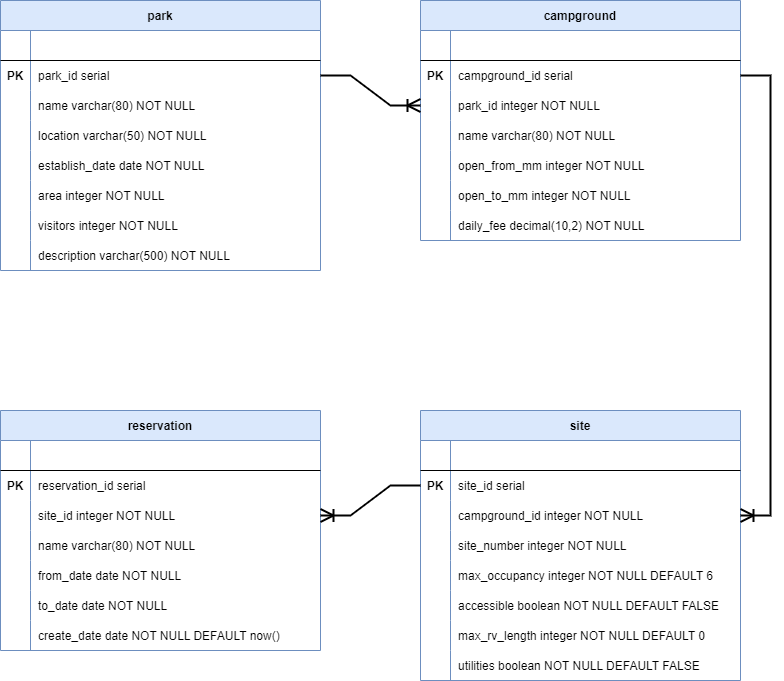

# Week 4 Review: National Park Campsite DAO Testing

In this exercise, you'll make use of a set of provided DAOs for the National Park Campsite Reservation database. The DAOs are complete and functioning. You don't need to make any modifications to them. Instead, you'll write a number of integration tests for the DAOs.

In addition to the DAOs, there is a small console application which you can use to see the DAOs in action. The application has a single main-level menu to select parks, campgrounds, and sites, and run a couple of queries. Like the DAOs, the application is complete, you don't need to make any changes to it.

## Requirements

* The project must not have any build errors.
* Code uses appropriate variable names and data types.
* Code is in a clean, organized format.
* Code is appropriately encapsulated.

## Step One: Review the database and starting code

### Database

The database is the National Parks Campsite database you've used in other exercises. It contains the four tables shown in the ER diagram:



You don't need to refresh the database prior to running the application or any of the integration tests you create as part of the exercise. Both the applications and tests automatically refresh the database upon startup. The refresh drops the database and runs the `campground.sql` script found in the project's `database` folder.

### Starting code

With the exception of the `JdbcCampgroundDaoTests.java`, `JdbcParkDaoTests.java` and `JdbcSiteDaoTests.java` test class files, all other code is fully implemented and doesn't require any modification. Please take a moment to familiarize yourself with the existing code, and in particular look at the starter code in the three test classes. This is where you add your implementations of the required tests for the `JdbcCampgroundDao`, `JdbcParkDao` and `JdbcSiteDao` DAOs.

### Run the application

Run `Application.main()` to launch the application. As previously mentioned, it's a small console application intended to allow you to see the DAOs in action. In particular, note the display of the DAOs results with all the fields for the objects returned. The intention is to facilitate writing the tests, which because of the greater details provided on the console can be more specific and targeted.

Note, you must select a park prior to selecting a campground, and a campground before picking a site. You must also select a park before running either of the queries on main menu. The application displays an error message if you didn't make a required selection.

## Step Two: Test the DAO selection methods

The `JdbcCampgroundDao`, `JdbcParkDao` and `JdbcSiteDao` DAOs have two selection methods each:

| DAO                 | Method                                                | Ordered By       |
| ------------------- | ----------------------------------------------------- | ---------------- |
| `JdbcCampgroundDao` | `Campground getCampgroundById(int campgroundId)`          | n/a              |
|                     | `List<Campground> getCampgroundsByParkId(int parkId)` | campground.name  |
| `JdbcParkDao`       | `Park getParkById(int parkId)`                            | n/a              |
|                     | `List<Park> getParks()`                            | park.name        |
| `JdbcSiteDao`       | `Site getSiteById(int siteId)`                            | n/a              |
|                     | `List<Site> getSitesByCampgroundId(int campgroundId)` | site.site_number |

Add two tests to each of the DAO test classes:

* `JdbcCampgroundDaoTests`
* `JdbcParkDaoTests`
* `JdbcSiteDaoTests`

For each test class, one test is for testing the method which returns a single object, the other test is for testing the method returning a `List`.

There are a total of six tests, three test classes with two tests each.

Run tests as you add them.

*You don't need to stop the application to test. You can test while the application is still running.*

### Test suggestions

Make use of the two convenience methods `mapValuesTo...()` and `assert...Match()` found in the test classes when testing the DAO methods which return a single object.

For instance, if you're testing `getCampgroundById()` you can make use of the campground details displayed on the console:

```
1: Campground{campgroundId=5, parkId=2, name='Canyon Wren Group Site', openFromMonth=1, openToMonth=12, dailyFee=160.00}
2: Campground{campgroundId=4, parkId=2, name='Devil's Garden', openFromMonth=1, openToMonth=12, dailyFee=25.00}
3: Campground{campgroundId=6, parkId=2, name='Juniper Group Site', openFromMonth=1, openToMonth=12, dailyFee=250.00}
```

to build an instance of a `Campground` with the `mapValuesToCampground()`:

```java
Campground expectedCampground = mapValuesToCampground(4, 2, "Devil's Garden", 1, 12, new BigDecimal("25.00"));
```

And then compare the `expectedCampground` with the `actualCampground` returned by the DAO method using the `assertCampgroundsMatch()`:

```java
Campground actualCampground = jdbcCampgroundDao.getCampgroundById(2);
assertCampgroundsMatch(expectedCampground, actualCampground);
```

As for testing the DAO methods which return a `List`, at a minimum test the number of items in the collection:

```java
List<Campground> campgrounds = jdbcCampgroundDao.getCampgroundsByParkId(2);
Assert.assertEquals("getCampgroundsByParkId(2) returned wrong number of campgrounds", 3, campgrounds.size());
```

Given that `getCampgroundsByParkId()` returns the campgrounds ordered by name, the first and last items in the list are predictable. You may also include `assertsCampgroundsMatch()` on the first and last items in the list to strengthen the overall coverage.

## Step Three: Test the Site DAO query methods

In addition to the select methods, the `JdbcSiteDao` includes two query methods:

| DAO           | Method                                        | Ordered By                              |
| ------------- | --------------------------------------------- | --------------------------------------- |
| `JdbcSiteDao` | `List<Site> getSitesThatAllowRVsByParkId(int parkId)` | site.campground_id<br/>site.site_number      |
|               | `List<Site> getAvailableSitesByParkId(int parkId)`    | site.campground_id<br/>site.site_number |

Since these methods return lists, they're tested in the same way described previously. At a minimum, the tests need to check the size of the `List` returned. Testing the first and last items in the list with `assertSitesMatch()` is also a great idea.
