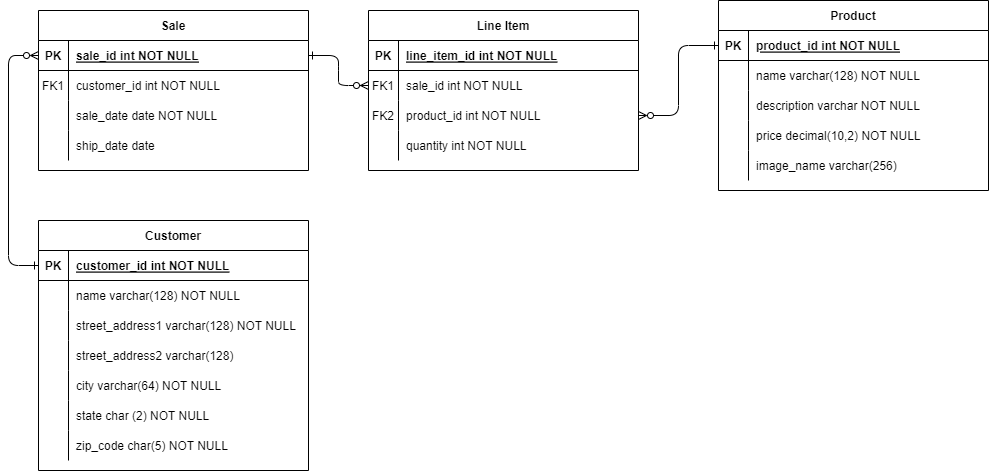

# Module Two mid-module project

This application allows employees in an e-commerce company to manage customer, product, and sales data. For example, users can view a list of products in the application and then choose to add, update, or delete the product data.

The [Requirements](#requirements) section later in this document describes more fully the application features.

## Database

Before running the application, create the `SSGeek` database. You must match the capitalization shown, or the application won't find the database.

After creating the database, run the `SSGeek.sql` script in the `database` folder to create and populate the database tables. Confirm that the tables exist by opening SSGeek -> Schemas -> Tables. After successfully running the script, you can find the `customer`, `line_item`, `product`, and `sale` tables inside.

Here is the Entity Relationship Diagram (ERD) of the database:

## Starting code

Once you have loaded the database, open the Module Two mid-module project in IntelliJ and review the starting code.

The project contains code defining the application's console user interface, including the required DAO interfaces and model classes. The code includes JavaDoc comments to explain the purpose of the various classes and methods.

Review the code provided, focusing on the following classes:

* `Application.java` - The *main* class of the application. Note the `TODO` comment indicating where to replace the `null` values.
* `CustomerDao.java` - The interface for accessing customer data, used by the application's "Customer admin" menu.
* `ProductDao.java` - The interface for accessing product data, used by the application's "Product admin" menu.
* `SaleDao.java` - The interface for accessing the sales data, used by the application's "Sales admin" menu.
* `LineItemDao.java` - The interface for accessing the sale line item details, used by the "Sales admin" menu.

## Requirements

Implement the DAO interfaces (`CustomerDao`, `ProductDao`, `SaleDao`, `LineItemDao`) and update the `Application` class to use them.

### Customer Admin Feature

The application must allow a user to:
* list all customers
* view customer details
* add a customer
* modify customer details

The `CustomerDao` interface provides methods to support these functions.

Create a `JdbcCustomerDao` class to implement this interface, writing tests to verify the methods behave correctly. Then create an instance of the DAO in the `Application` class to make the "Customer admin" menu options functional.

### Product Admin Feature

The application must allow a user to:
* list all products
* view product details
* add a product
* modify product details
* remove a product

The `ProductDao` interface provides methods to support these functions.

Create a `JdbcProductDao` class to implement this interface, writing tests to verify the methods behave correctly. Then create an instance of the DAO in the `Application` class to make the "Product admin" menu options functional.

### Sales Admin Feature

The application must allow a user to:
* list all sales orders for a customer
* list all sales orders for a product
* ship a sales order
* cancel (remove) a sales order

The `SaleDao` interface provides methods to support most of the Sales Admin Features.

Create a `JdbcSaleDao` class to implement this interface, writing tests to verify the methods behave correctly. Then create an instance in the `Application` class to complete the "Sales admin" menu features.

The application must also allow a user to view the details of a sales order.

The `LineItemDao` interface provides methods to support viewing the details of a sales order.

Create a `JdbcLineItemDao` class to implement this interface, writing tests to verify the methods behave correctly. Then create an instance in the `Application` class. Now the application is fully complete.
