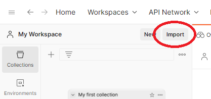
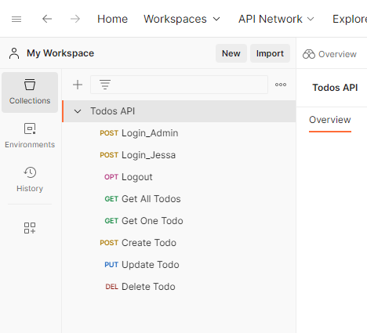

# Securing APIs exercise

## Introduction

_Frick & Frack, LLC._ has relied upon the multi-user _Todos_ application since their partnership began. It served them well when their business was just the two partners. However, as the enterprise has grown to dozens of employees, the previous security model has fallen short. _Frick & Frack, LLC._ has hired you to implement a more robust role-based security model.

The core of the system is the Todo API. There's already an `AuthenticationController` that allows users to log in. The `TodoController` serves the application data. Currently, its endpoints are all open, meaning anyone can access any endpoint, whether authenticated or not.

## Requirements

_Frick & Frack, LLC._ has determined the new security guidelines. Your task is to apply the proper annotations and program logic to lock down access to the API based on the following security requirements:

* The user must have logged in to access any endpoints on `TodoController` (the user must be _authenticated_).
* A user "has access to" read and update any todo item that meets at least one of these conditions:
    * The item's `createdBy` field is equal to their username.
    * Their username is in the list of `collaborators` on the item.
* When a user adds a new todo, you must store that user's username in the `createdBy` property of the new todo.
* You must add annotations or code to protect each of the endpoints according to the following table:

| Endpoint | Behavior | Response Status Codes |
| --- | --- | --- |
| `GET /todos` | Return list of items the current user has access to. If the user doesn't have access to any items, return an empty list. | 200 Ok |
| `GET /todos/{id}` | If the item doesn't exist, return `404`. If the item exists but the user doesn't have access to it, return `403`. Otherwise, return the todo with status `200`. | 200 Ok<br/>403 Forbidden<br/>404 Not found |
| `GET /todos/search?task=searchTerm` | Return list of items the current user has access to, that also contain _searchTerm_ in their `task`. If there are no such items, return an empty list. | 200 Ok |
| `POST /todos` | Any authenticated user can add a todo. Make sure `createdBy` contains the username of the current user before adding it. Return the added todo. | 201 Created |
| `PUT /todos/{id}` | If the item doesn't exist, return `404`. If the item exists but the user doesn't have access to it, return `403`. Otherwise, update the todo and return the updated todo. | 200 Ok<br/>403 Forbidden<br/>404 Not found |
| `DELETE /todos/{id}` | Only those with role **ADMIN** can delete a todo. If the user isn't an administrator, return `403`. | 204 No content<br/>403 Forbidden |

## Getting started

### Investigate the code

Open the Todo API application in your `exercise` folder, and explore the classes. Your work is primarily in the `TodoController` and `MemoryTodoDao` classes.

### Tests

The application already held some passing tests to ensure that users can read, update, and delete todos. The development team wrote additional tests for the new enhanced security requirements.

Run the tests. You'll see that some pass and some fail. The passing tests are _regression tests_. They confirm existing capability. If you make changes that cause one of these tests to fail, that's known as a _regression failure_. Your goal is to write the appropriate code that makes the failing tests pass, without breaking the passing tests.

### Importing the Postman collection

There's a `.json` file in the `postman` folder which contains a _collection_ of Postman requests against this API. You can import this collection using this procedure:
* Run Postman.
* From the _My Workspace_ toolbar, press the **Import** button.

    

* Click **files** and select the `.json` file to import. Postman displays the collection in the list:

    

### Using the Postman collection

Use this collection of requests to test and debug your API. The general instructions for running requests in this collection follow:

* In the Todo API project in _IntelliJ_, **Run** or **Debug** the TodoApplication. If you're debugging, set the breakpoints you need.
* In Postman, click a request. For example, click _Get All Todos_. Postman loads the request details into the main window.
* Update any parameters, such as the URL, Params, or the Body for your needs.
* Click the **Send** button to send the request to the server.
    * If you get an error like `Error: connect ECONNREFUSED 127.0.0.1:8080`, you may have forgotten to start the server.
* If you have breakpoints set, switch back to _IntelliJ_ to debug your code.
* When the server returns a response, inspect the response in Postman.

#### Authenticated endpoints

After you protect your server's endpoints with the `@PreAuthorize` annotation, you'll need to send a login request from Postman before sending any other requests. For example, if you run the `Get All Todos` request without first logging in, you'll receive something like:
```
{
    "timestamp": "2023-08-18T20:48:30.859+00:00",
    "status": 401,
    "error": "Unauthorized",
    "message": "Full authentication is required to access this resource",
    "path": "/todos"
}
```

To log in:

* In Postman, click one of the `Login_` requests. Notice that the request body includes `username` and `password`.
* With your server running, click **Send** in Postman.
* You'll receive a response that includes the new user token for your session. 
* After this, the Postman collection automatically attaches the user token to every request.

Now if you run `Get All Todos`, you'll get `200 Ok`.

To clear the token, effectively _logging out_ of the server, run the `Logout` request.


> Note: The collection contains login requests for `jessa` and `admin`. If you want to test other users, you can create requests to login. Modify the data in the `Body` of the request. Other user names are `liam`, `antoni`, `sofia`, `mark`, `jaden` and `susan`. For all these users, the password is `password`.

Once you're comfortable with the code and how to use Postman to call your server, you can start securing endpoints according to the requirements.

### Step 1: Protect all the endpoints

On `TodoController`, add an annotation to ensure that before any user can call any of its methods, that call must include an authentication token representing the authenticated user.

After you've completed this step, the `STEP1_` tests pass.

### Step 2: Save the `createdBy` user on add

In the `TodoController.add()` method, store the username of the logged-in user into the `todo.createdBy` by calling `setCreatedBy()`.

Remember that getting user information is a two-step process. 
1. First, add a `Principal` parameter to the method signature so Spring can supply user information:
    ```java
    public Todo add(@Valid @RequestBody Todo todo, Principal user) {
    ```
2. Then you use the `Principal` object to get the user name. You can use this in your call to `setCreatedBy()`:
    ```java
    String username = user.getName();
    ```

After you've completed this step, the `STEP2_` tests pass.

### Step 3: Prevent unauthorized read

In this step, you prevent an authenticated user from reading any todo that they shouldn't have access to.

#### `list()`

The `list()` method responds to endpoint `GET /todos`. When a user asks for a list of todos, that list must contain only todos that the user may access. This means you must filter the list based on the user.

Best practice is to do any list filtering in the DAO. If the datastore is a SQL database, you'll use a `WHERE` clause to prevent transmitting too many rows across the network. In this application, the datastore is an in-memory collection, but you'll still do the work in the DAO.

1. Add a `String` parameter for `username` to the `MemoryTodoDao.getTodos()` method. Don't forget to change the `TodoDao` interface, too.
1. In `MemoryTodoDao.getTodos()`, instead of returning a list with all todos, add filtering logic. Check each todo, and if the username is the same as `createdBy`, or if the username is in the `collaborators` collection, include it in the returned list. 
1. In the `TodoController.list()` method, add the username as an argument when calling `todoDao.getTodos()`. Refer to the previous step for how to get the username from the `Principal`.

#### `get()`

The `TodoController.get()` method responds to the `GET /todos/{id}` endpoint. It must return the requested todo only if the user has permission (by `createdBy` or `collaborators`). Implement the logic so that:
* If the todo exists and the user can access it, return the todo and HTTP status 200 Ok.
* If the todo exists and the user doesn't have access, return HTTP status 403 Forbidden.
* If the todo doesn't exist, return HTTP status 404 Not found.

> If you find yourself writing the same logic to determine user access multiple times, consider how you might refactor your code to consolidate user-access logic in one place.

#### `getByTask()`

`getByTask` responds to the `GET /todos/search?task={searchTerm}`. It filters the todos to return only those whose task description includes the `searchTerm` in a case-insensitive match.

Add logic so that the filtered list only includes todos the user has permission to access.

After you've completed this step, the `STEP3_` tests pass.

### Step 4: Prevent unauthorized update

In this step, you prevent an authenticated user from updating any todo that they shouldn't have access to.

`TodoController.update()` responds to the `PUT /todos/{id}` endpoint. Add logic to ensure that the user has access to a todo before calling the DAO method to update. 

After you've completed this step, the `STEP4_` tests pass.

### Step 5: Prevent unauthorized delete

In this step, you allow only users with the role `"ADMIN"` to delete a todo.

`TodoController.delete()` responds to the `DELETE /todos/{id}` endpoint. Add an annotation to ensure that the user must have role `"ADMIN"` to delete a todo. 

> **Hint:** You can do this with an annotation—you don't need to write any additional Java code inside the method.

After you've completed this step, the `STEP5_` tests pass.
