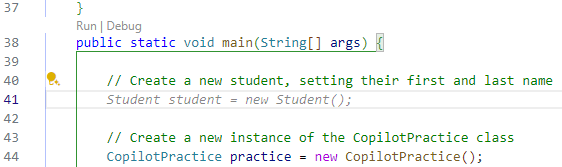

# Getting Started with GitHub Copilot

This exercise utilizes GitHub Copilot in VS Code. You can find setup instructions in the **Intro to Tools: GitHub Copilot** unit. 

Open VS Code and verify GitHub Copilot is active:

- Look for the GitHub Copilot icon  in the lower right portion of the VS Code status bar.
- Look for the GitHub Copilot Chat  icon in the left toolbar.

If Copilot isn't active, you may need to sign in. Go the **Accounts** icon in the lower left corner and select **Sign in with GitHub to use GitHub Copilot**:


## Getting code suggestions

In VS Code, open the `copilotPractice.js` file.

1. Start to type the following function definition:
    ```javascript
    function convertToMiles(km) {
    ```
2. As you type, GitHub Copilot automatically suggests code to complete the function using grayed text. Suggestions can vary, so what you see may be different.
    
3. Use `Tab` to accept the full suggestion. You can also use `Control + →` to accept the suggestion word by word.
4. To build the reverse function, start by entering a comment, then complete the function with help from GitHub Copilot:
    ```javascript
    // Convert miles to km
    ```

Now open the `CopilotPractice.java` file in VS Code as well. Use GitHub Copilot to create a Java class.

1. Use `Control+i` to open the inline GitHub Copilot chat interface.
2. Enter the following prompt:
    ```
        Create the CopilotPractice class with an array property called studentNames.
    ```
3. Allow GitHub Copilot to suggest the class structure, with the property, getter and setter, and a constructor. One suggestion follows, but it's not important that it matches exactly:
    ```java
    public class CopilotPractice {
        private String[] studentNames;

        // Constructor
        public CopilotPractice() {
            // Initialize the studentNames array
            studentNames = new String[0];
        }

        // Getters and setters
        public String[] getStudentNames() {
            return studentNames;
        }

        public void setStudentNames(String[] studentNames) {
            this.studentNames = studentNames;
        }
    }
    ```
4. Start adding the following method to the class:
    ```java
        // Check if a student name is in the array
        public boolean hasStudent(String studentName) {
    ```
5. As GitHub Copilot suggests a method body, use `Control+Enter` to see a list of suggestions:
    - The suggestion list opens in a separate pane.
    - Scroll through the list to explore the suggestions.
    - You can click the button to accept a suggestion entirely, or use copy/paste to take a portion of a suggestion.
6. Finish the `hasStudent()` method, then add an `addStudent()` method and `main()` method that tests the code in the class by:
    - Creating an instance of the class
    - Adding some student names
    - Verifying that the `hasStudent()` method correctly returns both `true` and `false`.
7. In the `main()` method, type your instance name followed by a `.` so that VS Code automatic code completion appears.
    - Notice the difference between this feature and GitHub Copilot's suggestions.
    - The VS Code automatic code completion tools have a broader context of your project, which allows it to know class and method names across multiple files.
    - GitHub Copilot doesn't have the same context, so it may suggest that you use class names and methods that aren't yet part of your project. In the following suggestion, it references a `Student` class that currently doesn't exist. While this may be helpful in some situations, it's important to realize that GitHub Copilot doesn't behave in the same way as the IDE automatic code completion feature:

        

### Using GitHub Copilot Chat

The GitHub Copilot extension also provides a chat feature that you can use to ask Copilot for assistance with any coding question.

While you have the `CopilotPractice.java` file open, try asking Copilot for help writing unit tests for the `hasStudent()` method (or whatever method name Copilot suggested). For example, you can type something similar to "Can you help me write unit tests for the hasStudent method?" and it'll generate a JUnit test with an explanation too.

You can also ask it to propose fixes or explain existing code. Try asking it to explain the method it generated.

> You can also access fixes and explanations by highlighting some code, right-clicking in the highlighted section, and selecting **Copilot -> Explain This** or **Copilot -> Fix This** from the context menu.

### Run Java code in VS Code

In VS Code, go to the extensions view and verify that the list of installed extensions includes Microsoft's `Extension Pack for Java`. If not, install the [Extension Pack for Java](https://marketplace.visualstudio.com/items?itemName=vscjava.vscode-java-pack) from the Marketplace.

To run the Java class in VS Code, in the `CopilotPractice.java` file:

1. Look for the **Run | Debug** option before the main method, and click **Run**:

    

2. This opens a terminal window where you can examine the program output. Note: The output may vary based on the code in your `main()` method:

    

> There is also an IntelliJ plugin for GitHub Copilot, but at this time it's recommended that you use GitHub Copilot in VS Code as the integration is better and the IntelliJ plugin currently doesn't include the chat feature.
