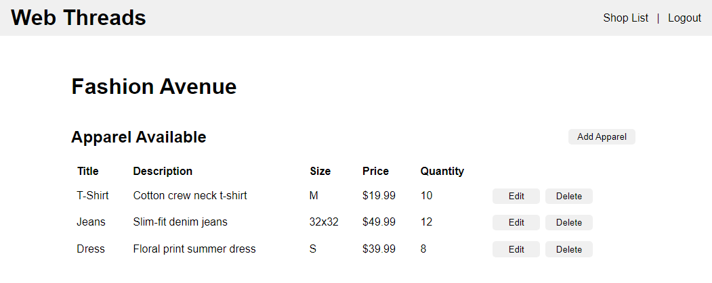
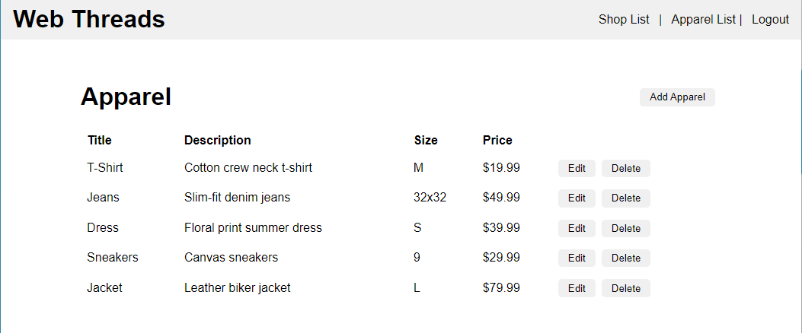

# Programming with GitHub Copilot

## Setup

This exercise provides you with client and server code for an existing application. The first step is to get this application up and running on your computer using VS Code.

1. Create a `web_threads_store` database. Then, use the provided database script to setup the tables and initial test data.
2. Start the Java server application in VS Code.
    - In the `server` directory, open the `Application.java` file.
    - Click `Run` on the `main` method, or look for the arrow in the upper right corner of the editor.
    - Watch for the Terminal to open in VS Code and the Spring server to start successfully on port 9000.
    - If the server doesn't start, check the error messages. The database connection is the most likely cause of an error.
3. After starting the server, run the Vue client application.
    - Open a terminal window and navigate to the `client` directory.
    - Install the Vue application: `npm install`.
    - Then run it: `npm run dev`.

Note: there's a test user set up for each of the applications authorization roles:
- `user_hq` is the test username representing a user from corporate headquarters
- `user_shop` is the test username for a user at a local shop
- `password` is the test password for both users

## Objectives

For this exercise, you'll use GitHub Copilot to support your work understanding and extending an existing application. The main goal of this exercise is to gain some experience coding with AI support. There are several features to add to this application, but don't be overly concerned with getting all of these features fully implemented and tested. Instead, focus on how you can use GitHub Copilot to support this work. You can always return to this code later to fix any bugs or continue adding more features.

Open the `personalReflections.md` file. This is a place for you to record your thoughts and notes as you work through this exercise. It also includes several questions and answers to the questions found throughout this exercise. Plan to __reserve at least 15 minutes__ to consider and respond to the reflection questions found at the end of this document.

## Using GitHub Copilot Chat to understand existing code

When jumping in to work on an existing application, you might discover new patterns or code that you're not familiar with. GitHub Copilot Chat can help you learn and understand this code. While this code includes many patterns you are familiar with, it also intentionally includes some new code patterns for you to explore.

Use GitHub Copilot Chat to explore the following sections of code. Highlight the indicated method, right-click in the highlighted section, select **Copilot -> Explain This** to have Copilot Chat explain the code. Then, in the `personalReflections.md` file, use copy/paste to Copilot's explanation of the code along with your own reflections and notes on its explanation.

1. The `getShopInventory()` method in the `ShopController` and the methods it calls in the `JdbcShopApparelDao`.
2. The `addApparelItems()` method in the `ShopService`.
3. The `ShopDetailView` uses an event pattern to manage data updates initiated by the child component `ShopApparelTable`.

## Using GitHub Copilot with daily tasks

There are a few remaining tasks for this application. As you add code to complete these features, use GitHub Copilot suggestions for support. Then, in the `personalReflections.md` file, note how you used GitHub Copilot to help you with each task.

1. From a code review, you've learned that `deleteApparelById()` in the `JdbcShopApparelDao` doesn't use best practices for transactions and mentioned something about adding an annotation.

2. Users reported a bug with the Shop Detail View. They noted that the delete doesn't work unless they refresh the page.

    

3. Users have been accidentally deleting items from the store that they shouldn't be. Your next task is to add a delete confirmation dialog to the Apparel List page asking: "Are you sure you want to delete this item and any inventory records from all stores?" As they expect the message to change, ensure that it's straightforward to find and modify the message in the future.

    

## Additional Challenges

If you have additional time, here are some additional tasks to explore:

1. Use Copilot chat to help you generate Javadocs for the server Controller and DAO classes.
    - Select a method, and open Copilot chat using the right-click context menu.
    - This offers some additional command options including **Generate Docs**.
    - Review the generated Javadocs for both technical and behavioral correctness.

2. The team is contemplating a better fix for the problems around deleting apparel items with stock at local stores. They've asked you to investigate ways that they could prevent the immediate delete of the apparel item if any store has inventory of that item, however, they want that delete to automatically happen when there is no stock left in any store. Use Copilot chat to learn about ways that the team might implement this. Create a list of options to discuss at the next team meeting.

3. The HQ team would like to be able to see a list of all employees at each store. Use Copilot to create a list of tasks for this work so that the team can estimate and assign the work at the next planning meeting.