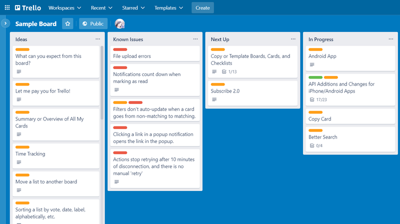
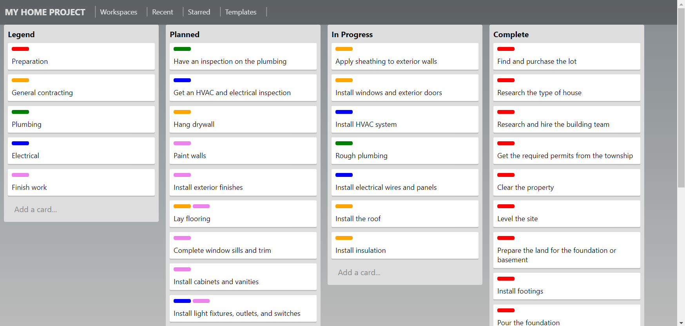
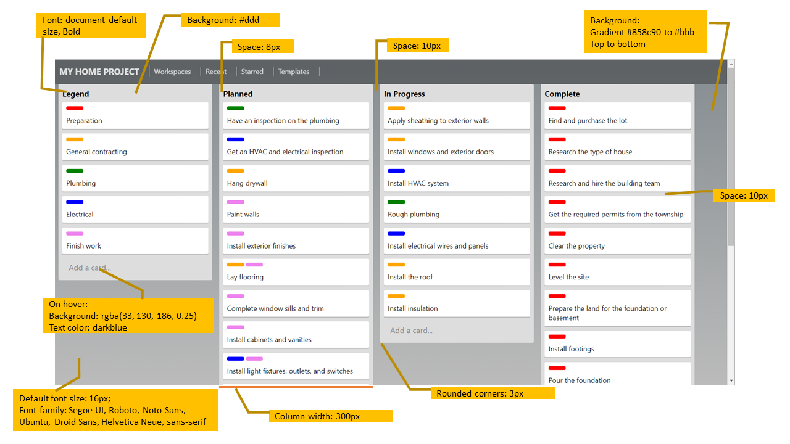
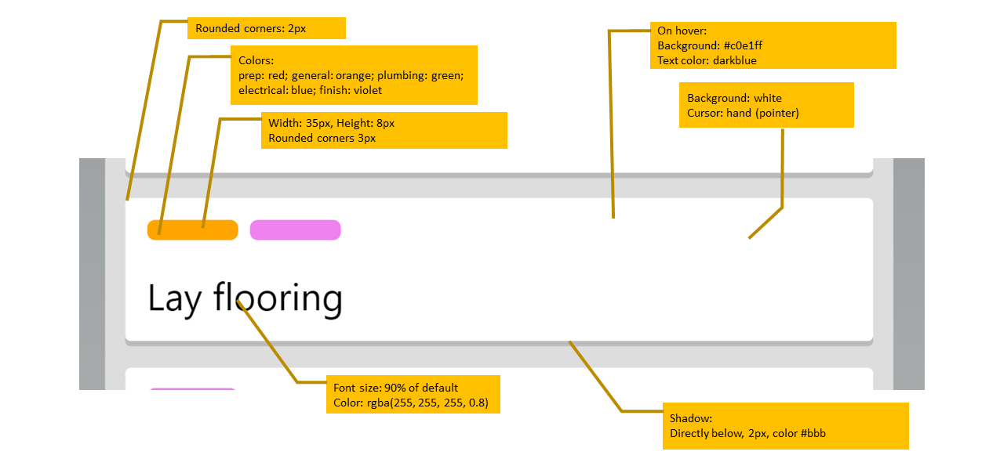
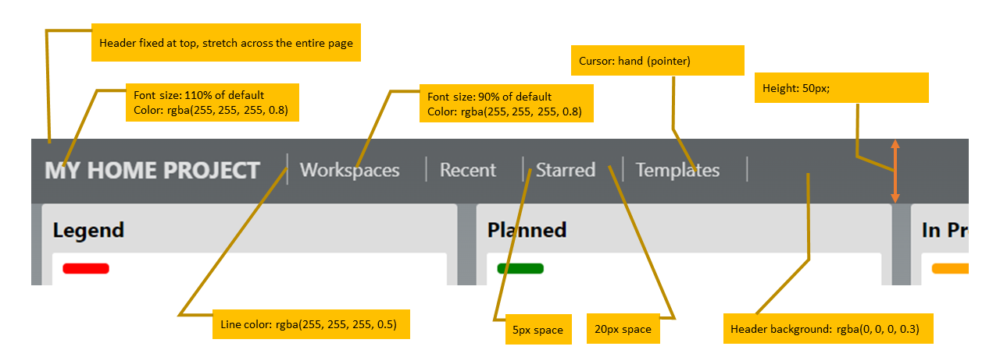

# Week 1 Pair Exercise: Trello clone

## Context

For this exercise, you'll practice your HTML and CSS skills by creating a page that mimics a Kanban-style list-making application such as [Trello](https://www.trello.com). This image shows an example of a board in Trello:



[Kanban boards](https://en.wikipedia.org/wiki/Kanban_board) visually depict work at various stages of a process using cards to represent work items and columns to represent each stage of the process. Cards move from left to right to show progress and to help coordinate teams performing the work.

In this exercise, you'll create a page that shows a house-building project on a kanban board:



To save you from typing all the task descriptions and labels, `index.html` contains the task list structure:

* The columns are `<section>` elements with `class="list"`.
* An `<h2>` within each column displays the column heading. 
* The task list within each column is a `<ul>`, with each task being an `<li>`.
* `<span class="label">` denotes a label within an `<li>`. An additional class indicates the type of label (general, plumbing, etc.). These are the small colored tags that appear on most cards.

```html
<section class="list">
  <h2>Planned</h2>
  <ul class="cards">
    <li class="card">
      <div class="labels">
        <span class="label plumbing"></span>
      </div>
      Have an inspection on the plumbing
    </li>
    <li class="card">
      <div class="labels">
        <span class="label electrical"></span>
      </div>
      Get an HVAC and electrical inspection
    </li>
    <li class="card">
    ...
```

> Note: You aren't required to use this structure for your solution, but it's a logical way to setup the HTML.


## Requirements

The designers have created wireframes to communicate the expected visual layout, and they're included in the following sections.

The steps listed in the following sections are a general recommendation on how you might approach this effort. It's likely that you'll iterate somewhat between the steps.

## Step one: Create a style sheet

All CSS rules must be in an external style sheet referenced by the HTML document. Create a new style sheet and add the `link` element into `index.html` to reference the styles.

## Step two: Board layout

Add CSS to the style sheet to change the list sections into columns, and the list items into cards. Reference the following diagram for specific measurements.



## Step three: Card detail

Add CSS to the style sheet to style the cards on the board. Reference the following diagram for specific measurements.



## Step four: Header and navigation bar

Add the _HTML and CSS_ to create a header bar with navigation links. Reference the following diagram for specific measurements.

> Note: The navigation links won't work—this exercise is all about visual styling only.



