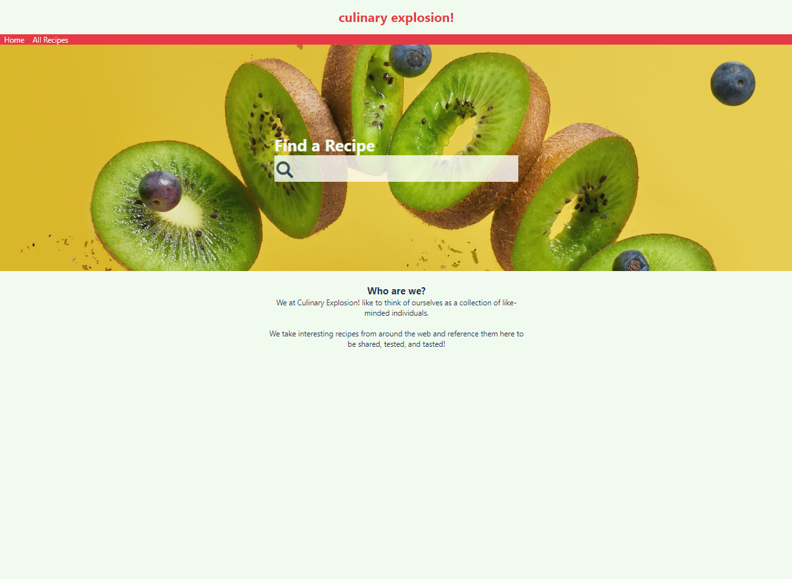
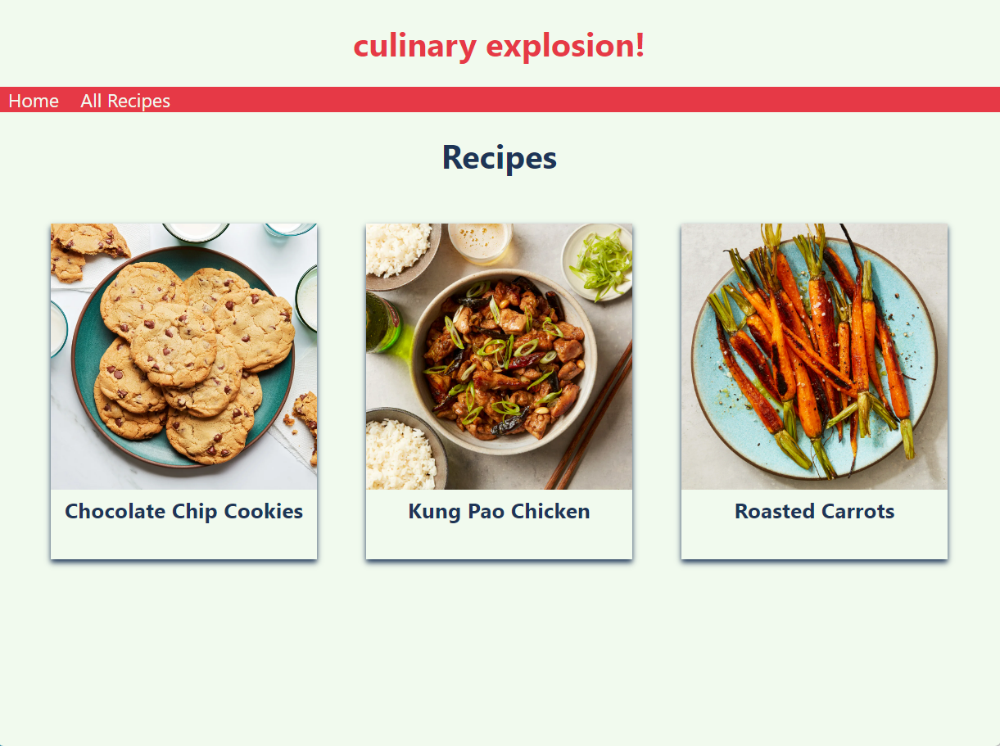
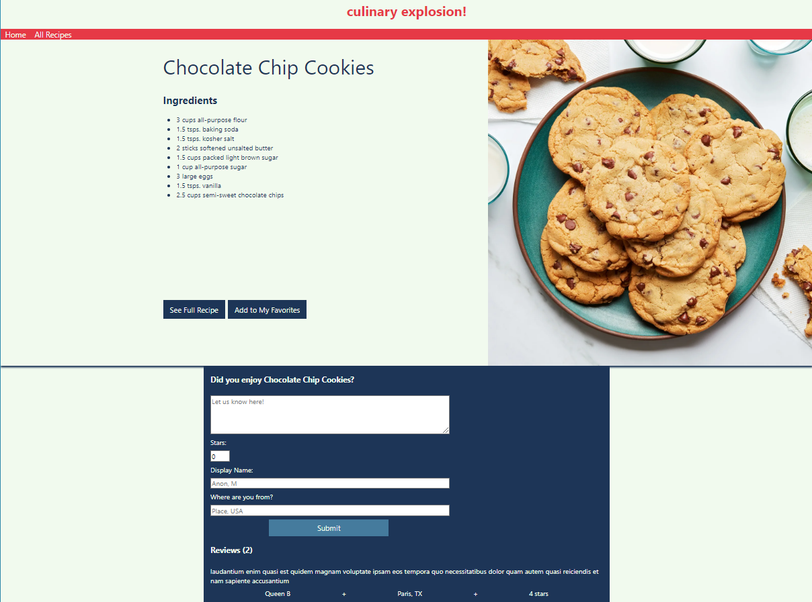
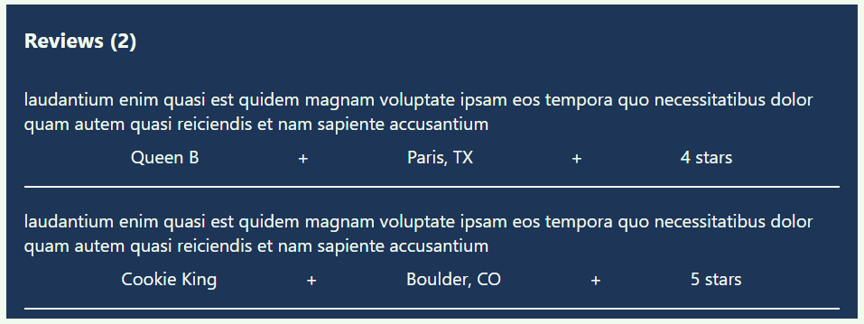
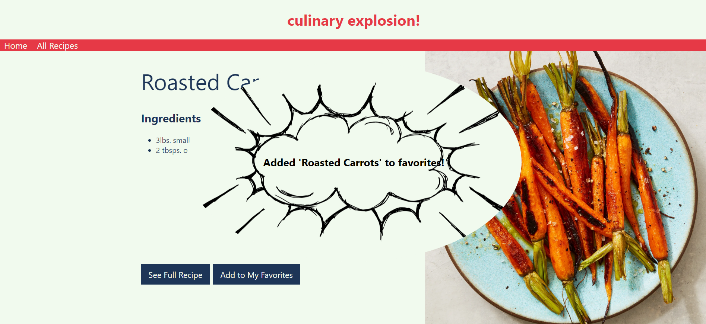

# Week 7 Review Pair Exercise

Congratulations—based on your fine work on the previous recipe project, Some Recipes, Inc. has invited you back to complete a more ambitious project featuring multiple recipes.

This new project requires using Vue Router and Vuex as described in the project requirements.

## Application overview

This application lets the user view a series of recipes stored in a database. Users can view the entire library of recipes or limit the recipes by entering a search term on the home screen:



The `MultipleRecipesView` displays recipes—either all recipes or a subset identified by a search term. In this view, each card contains the name of each recipe and its associated image:



The user can click an individual recipe card to get to the `SingleRecipeView`. This view offers additional information about the recipe, including its list of ingredients. It also includes a collection of all current reviews of the selected recipe. Finally, it contains a form that allows the user to submit a review:



## Starting code

The starting code is similar to most of the Vue projects you've worked with up to this point, with Vuex and Vue Router added. The starting code also contains several components and other files to assist you with the assignment. Before you begin coding, take a minute to review the following folders and files:

* `assets`—contains all photos referenced within the recipe data.
* `services`—provides the data for the application.
* `views`—contains `HomeView`, `MultipleRecipesView`, and `SingleRecipeView`. You'll add code to these views.
* `components`—includes a set of pre-built components, some requiring modification and others that you can use as-is.
* `router/index.js`—defines the application's routes.
* `store/index.js`—defines the data store. You'll use this file to host pop-up messages that appear in response to user activity.

## Requirements

**Requirement 1: Add routes to the view files**

Open the `src/router/index.js` file. Using the paths shown, create routes for the existing view files:

|   **Component**       |  **Path**     |
|-----------------------|---------------|
| `HomeView`            | `/`           |
| `MultipleRecipesView` | `/recipes`    |
| `SingleRecipeView`    | `/recipe/:id` |

**Requirement 2: Add a nav section**

Your application must always show links to `HomeView` and `MultipleRecipesView` at the top of the screen. Inside `App`, add a `nav` section holding links to those two views.

**Requirement 3: Add `RecipeCards` to the `MultipleRecipesView` view**

Add the `RecipeCards` component to `MultipleRecipesView` so it displays cards for all recipes. Be sure to pass the recipe data to the props in `RecipeCards`.

**Requirement 4: Add an event handler to individual recipe cards**

Add an event handler for each recipe card so that when the user clicks on a card, they move to the `SingleRecipeView` for that recipe. Be sure to set up the navigation using Vue Router.

**Requirement 5: Build `SingleRecipeView`**

Add the `RecipeDetails` component to `SingleRecipeView`. Be sure to pass the recipe data to it to display the recipe details.

Below `RecipeDetails`, add the `ReviewSection` component. Again be sure to pass the recipe data downstream.

**Requirement 6: Build the `ReviewCards` component**

Create a `ReviewCards` component that displays the reviews for a single recipe:



Add `ReviewCards` to the appropriate location in the `ReviewSection` component.

**Requirement 7: Add the `SearchBox` component**

Add the `SearchBox` component to the `HomeView` page. The `searchRecipe` method in the `SearchBox` component routes the user to the `MultipleRecipesView` with the search term as a query string parameter.

The `MultipleRecipesView` is responsible for filtering the recipes based on the search term. Currently, it displays **all** recipes, even if there's a search term. Modify the `computed` property `recipeData` as follows:
* If the search term is present, use the `searchRecipe` method in the `SearchService` to get the subset of recipes containing the search term.
* If there isn't a search term, then return all the recipes. 

**Requirement 8: Add pop-up messages using Vuex**

Add stylized pop-up messages that temporarily appear when the user:
* Adds a recipe to their favorites
* Leaves a review



The `AppMessage` component is responsible for displaying pop-up messages. It renders the message that's in the data store.

`AppMessage` renders conditionally inside of `App`, only appearing when a message exists. Therefore, you can make a message appear by assigning `$store.state.message` something other than an empty string. Conversely, you can make `AppMessage` disappear by setting `$store`.state.message` to an empty string.

**Requirement 8a: Add mutations to the data store**

The `state` section of your data store (`store/index.js`) contains a single variable called `message` which is initially assigned an empty string.

In the `mutations` section, create the methods `SET_MESSAGE` and `CLEAR_MESSAGE`.

`SET_MESSAGE` accepts `state` and `message` as parameters, then assigns `state.message` the value of `message`. After a delay of several seconds, `SET_MESSAGE` then reassigns `message` back to an empty string.

Click here for a hint on how to [set a timer in JavaScript](#setting-a-timer).

**Requirement 8b: Enable the `Add to Favorites` button**

In the `RecipeDetails` component, add an event listener to the `Add to Favorites` button. When the user clicks this button, have the data store change `message` to announce the addition of the current recipe to favorites.

>**NOTE**: you don't have to actually maintain a list of the user's favorite recipes.

**Requirement 8c: Trigger message upon review form submit**

Modify the `ReviewSection` so that when the user submits a new review, they receive a pop-up notification confirming the review submission.

## Hints

### Setting a timer

The `window.setTimeout` method sets a timer. When that timer expires, JavaScript executes the code specified in `setTimeout`.

For the first parameter, insert the code or method you want to execute. For the second, insert an integer representing the desired delay (in milliseconds) before the code runs:

```js
window.setTimeout(code, delay)
```
